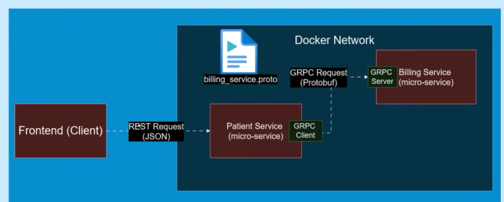

https://editor.swagger.io/   ==> this is an editor that is used to document springboot apis that you created in your app 

My recommendation

Yes, add one MongoDB-backed microservice, but give it a real purpose.

An Audit Service (or enhanced Analytics Service) that consumes Kafka events 
and stores flexible event documents in MongoDB is a strong design choice. 
It lets you explain why you chose a document database instead of PostgreSQL, which is exactly 
the kind of architectural reasoning senior interviewers look for.

If I had to choose between adding MongoDB and adding observability/testing, I'd do this:

✅ JWT Authentication & Authorization
✅ API Gateway security
✅ Flyway migrations
✅ Micrometer + Prometheus + Grafana
✅ OpenTelemetry tracing
✅ Testcontainers integration tests
✅ Redis caching
MongoDB Audit/Analytics Service
Kubernetes deployment

I would not move MongoDB ahead of observability or testing.

That's a great question. The gateway doesn't know automatically. You tell it in your filter code.

In your filter, this line is the key:

webClient.get()
.uri("/validate")

You also configured the WebClient with a base URL:

this.webClient = webclientBuilder
.baseUrl(authServiceUrl)
.build();

Suppose:

auth.service.url=http://auth-service:4005

Then when you write:

.uri("/validate")

the WebClient combines them:

Base URL: http://auth-service:4005
URI:      /validate
--------------------------------
Final URL:
http://auth-service:4005/validate

So the gateway is simply making an HTTP request to the endpoint you hardcoded.

Where does /validate come from?

It should exist in your Auth Service.

For example:

@RestController
@RequestMapping("/auth")
public class AuthController {

    @GetMapping("/validate")
    public ResponseEntity<Void> validateToken(
            @RequestHeader("Authorization") String token) {

        // Validate JWT

        return ResponseEntity.ok().build();
    }
}

Then the actual URL becomes:

GET http://auth-service:4005/auth/validate

In that case, your gateway filter should use:

.uri("/auth/validate")
How do I know what URI to use?

It must match whatever endpoint your Auth Service exposes.

For example:

If your auth service has:

@GetMapping("/validate")

then use:

.uri("/validate")

If it has:

@RequestMapping("/api/auth")
@GetMapping("/validate")

then use:

.uri("/api/auth/validate")
In general

The gateway is just another HTTP client.

Gateway
|
| GET http://auth-service:4005/auth/validate
|
v
Auth Service

It's no different from using Postman or curl to call the Auth Service. The only difference is that the gateway does it programmatically before forwarding the client's request.

If you're following a tutorial, check the AuthController in the Auth Service. The endpoint path defined there is exactly what you should pass to .uri(...).

